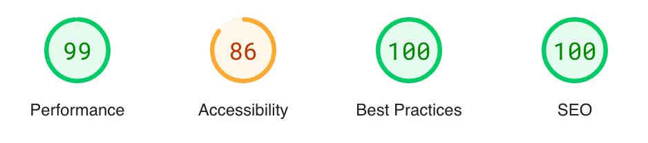

# Málaga Trivia

## Table of Contents
1. [Introduction](#introduction)
2. [Features](#features)
3. [Existing Features and Features to Implement](#existing-features-and-features-to-implement)
4. [User Stories](#user-stories)
5. [User Flow](#user-flow)
6. [Task Flow for Playing a Quiz](#task-flow-for-playing-a-quiz)
7. [Additional Notes](#additional-notes)
8. [Wireframes](#wireframes)
9. [Code Snippets](#code-snippets)
10. [Technologies Used](#technologies)
11. [Learning Outcomes](#learning-outcomes)
12. [Testing](#testing)
13. [Deployment](#deployment)
14. [Credits](#credits)

## Introduction

Introducing "Málaga Trivia" - a captivating quiz that takes you on a virtual journey through the sun-kissed streets and azure coasts of Málaga and Costa del Sol. Whether you're a native, a passionate traveler, or simply curious, this quiz offers a blend of cultural, historical, and fun-filled questions tailored to test and expand your knowledge about this Mediterranean paradise. From renowned landmarks to local delicacies and celebrated personalities, Málaga Trivia encapsulates the essence of Andalusia's crown jewel. Ready to challenge yourself? Dive in and discover the wonders of Málaga and the Costa del Sol!

Live webpage [here](https://igordinuzzi.github.io/malagatrivia/)

## Features

- Navigation with links to Play and Help, responsive on all devices.
Navigation in a webpage is crucial for providing a user-friendly experience by enabling visitors to efficiently explore and access the site's content, ultimately improving user engagement and satisfaction. 
It helps users find information, products, or services, leading to increased usability and retention.
 
  
- Footer with a Github link.
The footer contains important copyright information, asserting the originality and ownership of the content. Additionally, for those interested in delving deeper or collaborating, a direct link to our GitHub repository provides seamless access to the codebase.
   

- Favicon for easy recognition.
The favicon is important in a webpage as it provides a recognizable visual identity in browser tabs, enhancing brand visibility and user recognition, and it helps users quickly locate and return to the site.
  
  
- A welcoming landing page featuring a quiz about Málaga, which includes an introductory screen and a compulsory field for entering one's name.
    
  
- Quiz interface showcasing 30 different questions, of which only 10 are displayed during each gameplay session. Each question provides three answer options, but only one of them is correct.
  
  
- The user is given a ten-second window to respond to a question, as indicated by the timer functionality.
  
  
- The interface will provide feedback to the user if their answer is correct.
  
  
- The user will receive feedback from the system if their answer is incorrect and will be shown the correct response.
  
  
- The user will receive a score based on their responses to 10 questions and will be informed about the number of remaining questions.
  

- The user will be able to know how many questions are left.
  
  
- Users have the option to replay and will be guided back to the introductory screen.
  

 - Help Page - This support page features a tutorial embedded via a third-party "Iorad" iframe. It guides users on how to navigate the game and explains the type of feedback they can expect to receive.
   In this instructional guide, I employed the complimentary edition of Iorad, and consequently, the final frame showcases promotional content from Iorad, featuring links for user registration and access to additional  tutorials created within the Iorad platform. While this may potentially present a degree of ambiguity for end-users, it was retained in its original form due to the educational nature of this project, which is affiliated with a school context.
  

 - 404 page - Custom 404 page and the auto-redirect feature to the homepage. The custom 404 page and auto-redirect feature have been seamlessly integrated. This ensures that when a user encounters a 404 error, they will experience a smooth transition to the custom 404 page and subsequently be redirected to the homepage. 
  

## Existing Features and Features to Implement

**Existing features:**
- JavaScript functionality for displaying a welcome screen before the game starts.
- JavaScript functionality for generating random questions.
- JavaScript functionality for a countdown timer.
- JavaScript functionality for tracking scores.
- JavaScript functionality to restart the game.
- Iorad's external functionality for the assistance page.

### User Stories

1. **As a quiz enthusiast,** I want to test my knowledge about Málaga through a trivia game, so I can learn interesting facts while having fun.

2. **As a potential tourist,** I want to explore cultural and historical aspects of Málaga through an interactive quiz, to prepare for my visit.

3. **As a teacher,** I need an engaging tool to educate my students about Spanish cities, using Málaga Trivia to make learning enjoyable.

4. **As a local resident,** I want to participate in the trivia to see how well I know my city and share it with friends for a friendly competition.

### User Flow

1. **Landing on the Homepage**
   - Sees the header with the game title, 'Málaga Trivia'.
   - Offered options to either start playing ('PLAY') or seek help ('HELP').

2. **Starting the Quiz**
   - Clicks on 'PLAY' which leads to the welcome screen.
   - Reads the introductory text about Málaga Trivia.
   - Enters their name in the provided field.
   - Clicks 'Start Quiz' to begin.

3. **Playing the Quiz**
   - Presented with a series of questions about Málaga, each with multiple-choice answers.
   - Chooses an answer within the 10-second timeframe.
   - Receives immediate feedback on their choice.

4. **Completing the Quiz**
   - Upon answering all questions, views the final score.
   - Given the option to play again or exit.

5. **Seeking Help**
   - If needed, clicks on 'HELP' to understand how to play the game or for troubleshooting.

### Task Flow for Playing a Quiz

1. **Initiating the Quiz**
   - User clicks 'PLAY' and is prompted to enter their name.
   - After entering their name, the user clicks 'Start Quiz'.

2. **Answering Questions**
   - Presented with a question and multiple-choice answers.
   - Selects an answer before the timer runs out.
   - Views immediate feedback and progresses to the next question.

3. **Completing the Quiz**
   - After the last question, the quiz shows the final score.
   - The user can choose to play again, refreshing the questions and resetting the score.

### Additional Notes

- The quiz offers an engaging way to learn about Málaga, appealing to various users, from locals to potential tourists.
- The time-limited answers add excitement and challenge to the game.
- The quiz's design is straightforward and user-friendly, ensuring accessibility for all age groups.

## Wireframes

## Code snippets

## Technologies

The Malaga Trivia website utilizes the following technologies:

- Figma for design.
- FontAwesome for icons.
- CSS for styling.
- HTML for content.
- JavaScript for quiz features.
- Visual Studio Code for development.
- GitHub for version control.
- ChatGPT for content creation.

## Learning Outcomes

From a student's perspective, the development of the "Málaga Trivia" project offered a multitude of educational benefits and skill enhancements in various aspects of web development and design:
-JavaScript Application: Gained practical experience in JavaScript, particularly in creating interactive elements such as a countdown timer, random question generation, and a scoring system. This project served as a hands-on opportunity to apply JavaScript knowledge in a real-world scenario.
- Responsive Web Design: Learned to apply responsive design principles using CSS, ensuring the website is accessible and provides an optimal viewing experience across a range of devices, from mobile phones to desktop computers.
- User Experience (UX) Design: Developed a deeper understanding of UX principles by designing a quiz interface that is intuitive, engaging, and easy to navigate. This included creating immediate feedback mechanisms for quiz responses and ensuring the website is user-friendly.
- Problem-Solving Skills: Enhanced problem-solving abilities by tackling various challenges that arose during development, such as implementing a timer functionality and ensuring consistent behavior across different web browsers.
- Time Management and Project Planning: Improved time management and project planning skills, learning to allocate time effectively to different aspects of the project and to plan the development process from conception to deployment.
- Version Control and Deployment: Became more proficient in using version control systems like Git and GitHub, which are essential for collaborative development. Also learned the process of deploying a web application to GitHub Pages.
- Cross-Browser Compatibility: Gained insight into the importance of ensuring that web applications perform consistently across various web browsers, leading to a better understanding of web standards and compatibility issues.
- Content Creation and SEO: Learned about content creation with a focus on engaging users and search engine optimization (SEO) best practices to make the website more discoverable.
- Cultural Insight and Educational Value: Through the process of creating a quiz about Málaga, gained valuable insights into the cultural, historical, and geographic aspects of the region, enhancing personal knowledge and appreciation for the subject matter.
- Feedback Implementation: Learned to implement user feedback effectively, which is vital for the iterative process of improving a web application's design and functionality.

## Testing

The website has been thoroughly tested on various devices and browsers:

- Mobile (iPhone 14)
- Smaller laptop MacBook Air
- iMac

**Responsiveness:**

All pages were tested to ensure responsiveness on screen sizes from 320px and upwards as defined in WCAG 2.1 Reflow criteria for responsive design on Chrome, Edge, Firefox, Safari and Opera browsers.

Steps to test:

- Open browser and navigate to Malaga Trivia
- Open the developer tools (right click and inspect)
- Set to responsive and decrease width to 320px
- Set the zoom to 50%
- Click and drag the responsive window to maximum width

Expected:

Website is responsive on all screen sizes and no images are pixelated or stretched. No horizontal scroll is present. No elements overlap.

Actual:

Website behaved as expected.

Website was also opened on the following devices and no responsive issues were seen:

- iPhone 14
- iPhone SE
- Samsung Galaxy Android S20 Android 11
- Macbook Air
- iMac 27''
- iMac 24''

**Accessibility:**

[Wave Accessibility](https://wave.webaim.org/) tool was used throughout the development and for final testing of the deployed website to check for any aid accessibility testing.

Testing was focused to ensure the following criteria were met:

| Page            | Page to Load          | Errors                | Contrast Errors       | Alerts                             | Features             | Structural elements   | Aria                  |
| --------------- | ----------------------| ----------------------| ----------------------| ----------------------------------| ----------------------| ----------------------| ----------------------|
| Home            | index.html            | 0                     | 0                     | 1(redundant link to the homepage) | 2                     | 5                     | 7                     |
| Help            | help.html             | 0                     | 0                     | 1(redundant link to the homepage) | 1                     | 4                     | 5                     |
| 404             | 404.html              | 0                     | 0                     | 1(redundant link to the homepage) | 1                     | 4                     | 5                     |

- All forms have associated labels or aria-labels so that this is read out on a screen reader to users who tab to form inputs
- Color contrasts meet a minimum ratio as specified in WCAG 2.1 Contrast Guidelines
- Heading levels are not missed or skipped to ensure the importance of content is relayed correctly to the end user
- All content is contained within landmarks to ensure ease of use for assistive technology, allowing the user to navigate by page regions
- All not textual content had alternative text or titles so descriptions were read out to screen readers
- HTML page lang attribute has been set
- Aria properties have been implemented correctly
- WCAG 2.1 Coding best practices being followed

Manual tests were also performed to ensure the website was as accessible as possible and an accessibility issue was identified.

I've discovered several errors on the webpage, specifically related to headers and the iframe. I fixed these issues to enhance accessibility and ensure that all users can easily navigate and interact with the content, promoting a more inclusive and user-friendly experience.

**Browser Compatibility Checked:**

- Safari
- Firefox
- Google Chrome

**Functional Testing**

Navigation Links:

Testing was performed to ensure all navigation links on the respective pages, navigated to the correct pages as per design. This was done by clicking on the navigation links on each page.

| Navigation Link | Page to Load          |
| --------------- | ----------------------|
| Home            | index.html            |
| Help            | help.html             |
| 404             | 404.html              |

Links on all pages navigated to the correct pages as exptected.

| Test Case                 | Description                                                       | Expected Result                                                                  |
|---------------------------|-------------------------------------------------------------------|----------------------------------------------------------------------------------|
| 1. Homepage               | Verify that the homepage loads successfully.                      | Page loads without errors.                                                       |
| 2. Navigation             | Test the navigation menu to ensure all links are functional.      | All links navigate to the correct pages.                                         |
| 3. Field                  | Check if field get back with error messages                       | Errors are visible.                                                              |
| 4. Images                 | Confirm that images load properly and are not broken.             | All images are displayed without errors.                                         |
| 5. Feedback system        | Test the system return right/wrong answers.                       | System get backs with right and wrong answers.                                   | 
| 6. Mobile Responsiveness  | Test the webpage on different screen sizes.                       | Content adjusts and remains readable on various screen sizes.                    |
| 7. Browser Compatibility  | Verify that the webpage works on multiple browsers.               | Webpage functions correctly on popular browsers (Chrome, Firefox, Safari, etc.). |
| 8. Timer                  | Check if timer is functional.                                     | Timer counts down from 10 to 0 and shows a "Time's up" message                   |
| 9. Loading Speed          | Measure the loading speed of the webpage.                         | Page loads within an acceptable time frame.                                      |
| 10. Error Handling        | Test for proper error messages when encountering issues.          | Appropriate error messages are displayed when errors occur.                      |

_Scenario One - Correct Inputs_

Steps to test:

1. Navigate to [Home Page](https://igordinuzzi.github.io/malagatrivia/index.html)
2. Scroll down to the form and input the following data:
   - Name: Your name
3. Click "Start Quiz"
4. User should be redirected to the quiz page

Expected:

Form submits with no warnings or errors and user is redirected to the quiz.

Actual:

Website behaved as expected with no errors or warnings and redirected to quiz page.

_Scenario Two - Missing Required Field Name_

Steps to test:

1. Navigate to [Home Page](https://igordinuzzi.github.io/malagatrivia/index.html)
2. Scroll down to the form and input the following data:
   - Name: Your name
3. Click "Start Quiz"
4. User should be redirected to the quiz page

Expected:

The form does not submit and an Error is displayed to tell the user that the field is required.

Actual:

Website behaved as expected, error message was displayed and the form did not submit.

_Scenario Three - System feedback_

Steps to test:

1. Navigate to [Home Page](https://igordinuzzi.github.io/malagatrivia/index.html)
2. Scroll down to the form and input the following data:
   - Name: Your name
3. Click "Start Quiz"
4. Once the quiz has started click on one choice
5. User should receive feedback (right choice or wrong choice) from the system

Expected:

Feedback is displayed.

Actual:

Website behaved as expected, feedback message was displayed.

_Scenario Four - Timer_

Steps to test:

1. Navigate to [Home Page](https://igordinuzzi.github.io/malagatrivia/index.html)
2. Scroll down to the form and input the following data:
   - Name: Your name
3. Click "Start Quiz"
4. Once the quiz has started the timer is pacing the questions
5. User should be able to see the timer counting down. 

Expected:

The timer is shown and counts down from 10 seconds to 0.

Actual:

Website behaved as expected, timer counts down.

_Scenario Five - Score_

Steps to test:

1. Navigate to [Home Page](https://igordinuzzi.github.io/malagatrivia/index.html)
2. Scroll down to the form and input the following data:
   - Name: Your name
3. Click "Start Quiz"
4. Once the quiz has started the timer is pacing the questions
5. The user should be able to view scores ranging from 1 to 10.

Expected:

The score label displays and increments from 1 to 10.

Actual:

The website performed as anticipated, and the scoring mechanism is functional.

**Footer Links**

Testing was performed on the Github link in the footer to ensure that each one opened in a new tab.

Opened a new tab when clicked as expected.

**Usability Testing**

*Scope:*
The usability testing for the Malaga Trivia Quiz is aimed at evaluating the user-friendliness and overall experience of the quiz. This testing involves five users who will interact with the quiz, providing feedback on the user interface, ease of navigation, and the overall quiz experience.

**Participants:**
1. Maria L.
2. Carlos R.
3. Ana M.
4. Javier G.
5. Laura F.

**Tasks and Feedback:**

*Task 1 - Quiz Introduction:*
- Participants will be instructed to access the quiz.
- They should review the quiz's introduction and description.
- Provide feedback on the clarity and appeal of the introduction.

*Feedback Summary:*
- All participants found the quiz introduction clear and engaging.

*Task 2 - Starting the Quiz:*
- Participants will click on the "Start Quiz" button.
- They should provide feedback on the loading time and the transition to the quiz questions.

*Feedback Summary:*
- All participants mentioned that the transition to the quiz was smooth, and the loading time was acceptable.

*Task 3 - Navigating the Quiz:*
- Participants will proceed to answer the quiz questions.
- They will answer some questions correctly and some incorrectly.
- Participants should comment on the layout, ease of selecting answers, and the overall flow of the quiz.

*Feedback Summary:*
- All participants found it easy to navigate the quiz, and they praised the user-friendly design.
- They appreciated the immediate feedback after answering each question.

*Task 4 - Correct Answer Feedback:*
- Participants should answer a question correctly.
- After getting a correct answer, they should provide feedback on the feedback message and the points awarded.

*Feedback Summary:*
- All participants felt motivated and engaged by the positive feedback for correct answers.

*Task 5 - Incorrect Answer Feedback:*
- Participants should answer a question incorrectly.
- After getting a wrong answer, they should provide feedback on the feedback message and any hints provided.

*Feedback Summary:*
- All participants found the feedback for wrong answers helpful and informative, helping them learn from their mistakes.

**Overall Feedback:**
- All participants mentioned that the quiz was engaging and enjoyable.
- They praised the design and user interface for being intuitive and visually appealing.
- Participants found the feedback for correct and incorrect answers beneficial for their learning experience.

**Conclusion:**
The usability testing of the Malaga Trivia Quiz with five users was a big success. All participants found the quiz easy to navigate, engaging, and appreciated the immediate feedback. The design and user interface received positive feedback, and the quiz's overall usability was rated highly. The feedback provided valuable insights into the user experience and confirmed the quiz's user-friendliness.

**Lighthouse Report:**

- Landing Page
  

- Help Page
  The low accessibility score is attributed to the third-party iframe.
  While iframes can be useful for embedding third-party content, they can also introduce performance and accessibility challenges.
  The third-party iframe is heavy or not well-optimized. Iframes can disrupt the natural tabbing order, making it confusing for users relying on keyboards or screen readers to navigate.
  

- 404 Page
  The low accessibility score is attributed to the redirection. In order to ensure users are informed about the impending redirection, I have included a text warning stating that an automatic redirection will occur in 10 seconds unless they take action, in addition to the call to action that directs them back to the homepage.
    

**W3C Validator results:**

- Landing Page
  

- Help Page
  

- 404 Page
  

 **JS Validator results:** 
     

 **JS Hint results:** 
      

## Deployment:

**Version Control:**

The site was created using the Visual Studio code editor and pushed to github to the remote repository ‘Malagatrivia’.
The following git commands were used throughout development to push code to the remote repo:
git add <file> - This command was used to add the file(s) to the staging area before they are committed.
git commit -m “commit message” - This command was used to commit changes to the local repository queue ready for the final step.
git push - This command was used to push all committed code to the remote repository on github.

**Deployment to Github Pages:**

The site was deployed to GitHub pages. The steps to deploy are as follows:
In the GitHub repository, navigate to the Settings tab
From the menu on left select 'Pages'
From the source section drop-down menu, select the Branch: main
Click 'Save'
A live link will be displayed in a green banner when published successfully.
The live link can be found [here](https://igordinuzzi.github.io/malagatrivia/index.html)

## Credits

- Written content by ChatGPT
- Iconography [here](https://fontawesome.com/v4/icons/)
- Images by Unsplash

